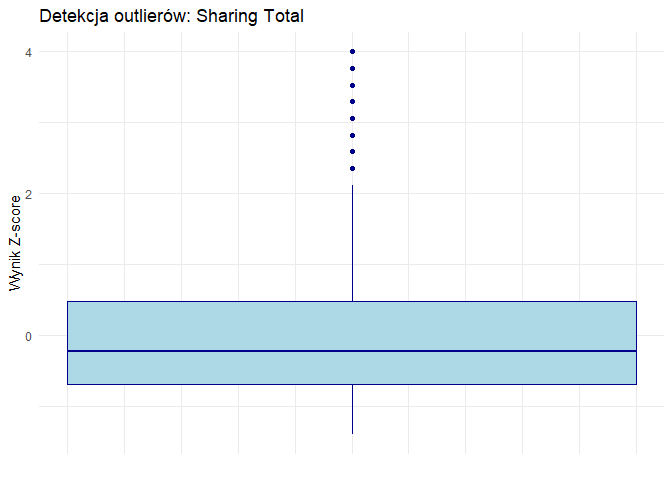
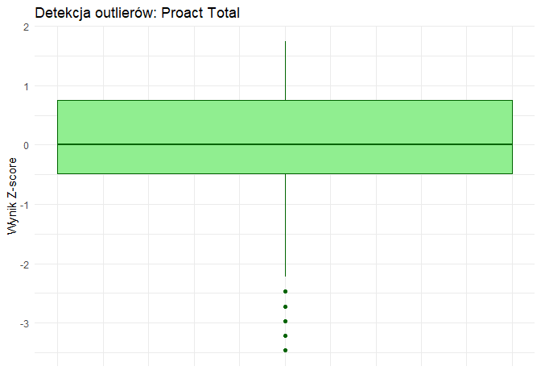
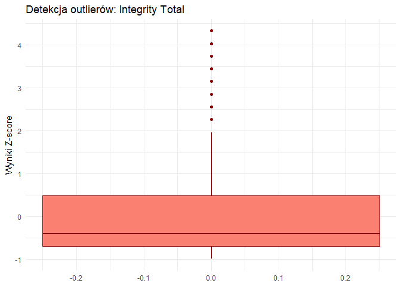
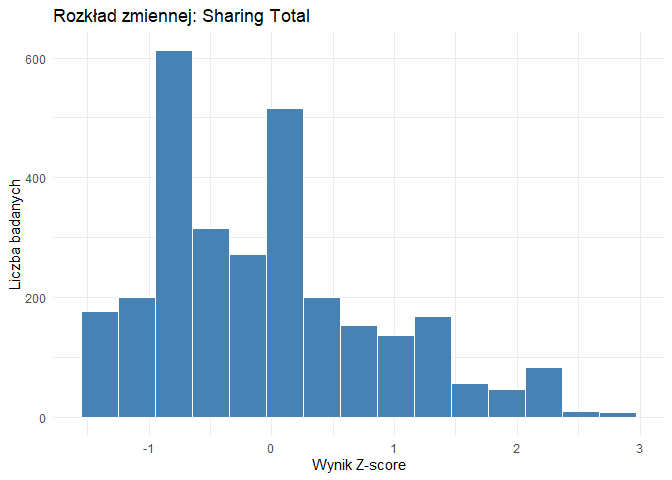
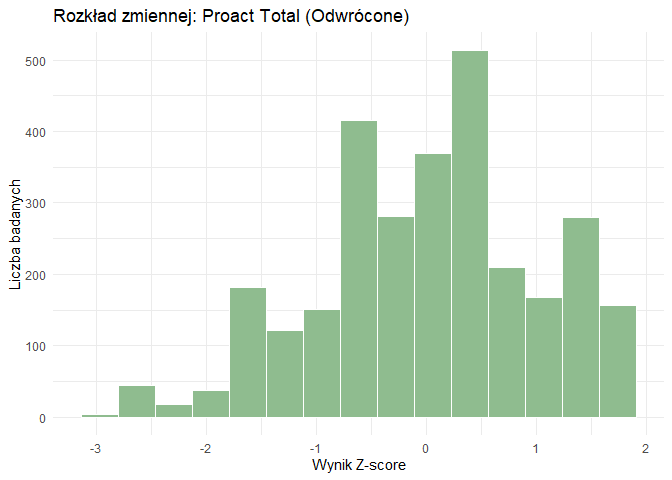
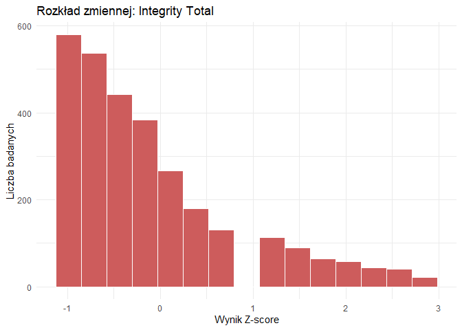
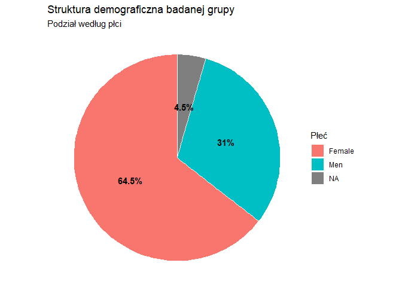
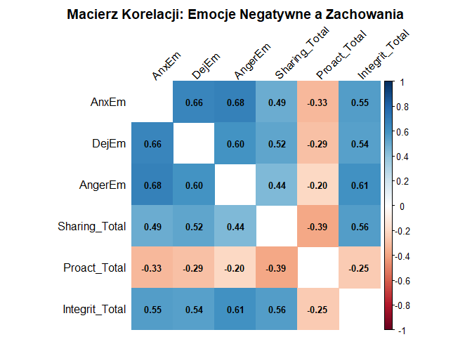

Eksploracyjna Analiza Danych (EDA)
================
Piotr Machyński
2026-12-03

``` r
library(dplyr)
```

    ## 
    ## Dołączanie pakietu: 'dplyr'

    ## Następujące obiekty zostały zakryte z 'package:stats':
    ## 
    ##     filter, lag

    ## Następujące obiekty zostały zakryte z 'package:base':
    ## 
    ##     intersect, setdiff, setequal, union

``` r
library(ggplot2)
dane <- read.csv("dane_rekodowane.csv")
```

# Przegląd zmiennych

``` r
summary(dane)
```

    ##      Sex                Age              Function            Share_1     
    ##  Length:3019        Length:3019        Length:3019        Min.   :0.000  
    ##  Class :character   Class :character   Class :character   1st Qu.:1.000  
    ##  Mode  :character   Mode  :character   Mode  :character   Median :2.000  
    ##                                                           Mean   :1.721  
    ##                                                           3rd Qu.:2.000  
    ##                                                           Max.   :4.000  
    ##     Share_2         Share_3       Proact_1_R      Proact_2_R      Proact_3_R   
    ##  Min.   :1.000   Min.   :1.00   Min.   :2.000   Min.   :2.000   Min.   :2.000  
    ##  1st Qu.:1.000   1st Qu.:3.00   1st Qu.:4.000   1st Qu.:4.000   1st Qu.:4.000  
    ##  Median :2.000   Median :3.00   Median :5.000   Median :4.000   Median :5.000  
    ##  Mean   :1.858   Mean   :2.98   Mean   :4.383   Mean   :4.286   Mean   :4.642  
    ##  3rd Qu.:2.000   3rd Qu.:4.00   3rd Qu.:5.000   3rd Qu.:5.000   3rd Qu.:5.000  
    ##  Max.   :4.000   Max.   :4.00   Max.   :5.000   Max.   :5.000   Max.   :5.000  
    ##    Integ_1_R       Integ_2_R       Integ_3_R     Sharing_Total    
    ##  Min.   :2.000   Min.   :0.000   Min.   :2.000   Min.   :-1.4017  
    ##  1st Qu.:4.000   1st Qu.:2.000   1st Qu.:4.000   1st Qu.:-0.6975  
    ##  Median :5.000   Median :3.000   Median :5.000   Median :-0.2280  
    ##  Mean   :4.417   Mean   :2.941   Mean   :4.495   Mean   : 0.0000  
    ##  3rd Qu.:5.000   3rd Qu.:3.000   3rd Qu.:5.000   3rd Qu.: 0.4763  
    ##  Max.   :5.000   Max.   :5.000   Max.   :5.000   Max.   : 3.9976  
    ##   Proact_Total       Integrit_Total        AnxEm           HappEm     
    ##  Min.   :-3.466038   Min.   :-0.9881   Min.   :1.000   Min.   :1.000  
    ##  1st Qu.:-0.490572   1st Qu.:-0.6927   1st Qu.:1.250   1st Qu.:2.140  
    ##  Median : 0.005339   Median :-0.3974   Median :1.630   Median :2.710  
    ##  Mean   : 0.000000   Mean   : 0.0000   Mean   :1.746   Mean   :2.673  
    ##  3rd Qu.: 0.749204   3rd Qu.: 0.4885   3rd Qu.:2.130   3rd Qu.:3.140  
    ##  Max.   : 1.741027   Max.   : 4.3275   Max.   :4.000   Max.   :4.000  
    ##      DejEm          AngerEm     
    ##  Min.   :1.000   Min.   :1.000  
    ##  1st Qu.:1.200   1st Qu.:1.500  
    ##  Median :1.400   Median :1.750  
    ##  Mean   :1.604   Mean   :1.871  
    ##  3rd Qu.:2.000   3rd Qu.:2.250  
    ##  Max.   :4.000   Max.   :4.000

## Identyfikacja i redukcja outlierów

### Detekcja outlierów: Sharing Total

``` r
ggplot(data = dane, aes(y = Sharing_Total)) +
  geom_boxplot(fill = "lightblue", color = "darkblue", width = 0.5) +
  theme_minimal() +
  labs(
    title = "Detekcja outlierów: Sharing Total",
    y = "Wynik Z-score",
    x = ""
  ) +

  theme(axis.text.x = element_blank(), axis.ticks.x = element_blank())
```

<!-- -->

### Detekcja outlierów: Proact Total

``` r
ggplot(data = dane, aes(y = Proact_Total)) +
  geom_boxplot(fill = "lightgreen", color = "darkgreen", width = 0.5) +
  theme_minimal() +
  labs(
    title = "Detekcja outlierów: Proact Total",
    y = "Wynik Z-score",
    x = ""
  ) +
  theme(axis.text.x = element_blank(), axis.ticks.x = element_blank())
```

<!-- -->

### Detekcja outlierów: Integrity_Total

``` r
ggplot(data=dane,aes(y=Integrit_Total)) + 
  geom_boxplot(fill = "salmon", color= "darkred", width=0.5) +
  theme_minimal() +
  labs(
    title="Detekcja outlierów: Integrity Total",
    y="Wyniki Z-score",
    x=""
    ) +
  theme(axis.title.x = element_blank(), axis.ticks.x = element_blank())
```

<!-- -->

### Usunięcie outlierów

Poniższy skrypt usuwa outliery, których wynik z-score wskazuję oddalenie
od średniej o ponad 3 odchylenia standardowe.

``` r
#Identyfikacja
outliery <- dane %>%
  filter(
    abs(Sharing_Total) > 3 | 
    abs(Proact_Total) > 3 | 
    abs(Integrit_Total) > 3
  )
View(outliery)

#Usunięcie

dane <-dane %>%
  filter(
    abs(Sharing_Total) <= 3 & 
    abs(Proact_Total) <= 3 & 
    abs(Integrit_Total) <= 3
  )

#Just for sure
glimpse(dane)
```

    ## Rows: 2,951
    ## Columns: 19
    ## $ Sex            <chr> "Female", NA, "Female", "Female", "Female", "Men", "Fem…
    ## $ Age            <chr> "20-25 y.", "20-25 y.", "20-25 y.", "<20 y.", "20-25 y.…
    ## $ Function       <chr> "Employe", "Employe", "Employe", "Employe", "Employe", …
    ## $ Share_1        <int> 2, 1, 1, 2, 2, 1, 2, 2, 2, 2, 2, 3, 2, 3, 1, 1, 2, 1, 2…
    ## $ Share_2        <int> 1, 2, 1, 2, 1, 1, 2, 1, 2, 1, 2, 1, 1, 1, 2, 1, 2, 1, 2…
    ## $ Share_3        <int> 3, 4, 2, 3, 2, 3, 4, 3, 2, 2, 3, 3, 2, 2, 3, 4, 4, 3, 3…
    ## $ Proact_1_R     <int> 5, 5, 5, 4, 4, 5, 5, 4, 4, 5, 5, 3, 5, 3, 5, 5, 5, 5, 4…
    ## $ Proact_2_R     <int> 5, 5, 5, 4, 5, 5, 5, 4, 5, 5, 4, 5, 4, 5, 4, 5, 5, 4, 5…
    ## $ Proact_3_R     <int> 5, 4, 5, 5, 5, 5, 5, 5, 5, 5, 5, 5, 4, 5, 5, 5, 5, 5, 5…
    ## $ Integ_1_R      <int> 5, 5, 4, 5, 4, 5, 5, 5, 4, 5, 5, 2, 5, 5, 5, 5, 5, 5, 5…
    ## $ Integ_2_R      <int> 2, 3, 4, 3, 4, 3, 2, 3, 2, 5, 4, 4, 4, 3, 2, 3, 2, 3, 3…
    ## $ Integ_3_R      <int> 4, 5, 4, 5, 5, 5, 5, 5, 5, 5, 5, 5, 5, 5, 5, 5, 5, 5, 5…
    ## $ Sharing_Total  <dbl> -0.697492292, -0.227987447, -0.227987447, -0.227987447,…
    ## $ Proact_Total   <dbl> 0.005338547, 0.997161197, -1.234439330, -0.490571909, -…
    ## $ Integrit_Total <dbl> -0.1021211, -0.1021211, -0.1021211, -0.6927400, -0.6927…
    ## $ AnxEm          <dbl> 1.63, 2.50, 1.75, 2.63, 3.00, 1.25, 1.63, 2.13, 2.13, 1…
    ## $ HappEm         <dbl> 2.00, 1.86, 1.57, 2.14, 1.86, 3.00, 3.29, 2.57, 2.43, 2…
    ## $ DejEm          <dbl> 1.2, 3.0, 2.2, 1.8, 2.2, 1.2, 1.2, 1.4, 1.6, 1.4, 1.0, …
    ## $ AngerEm        <dbl> 2.25, 2.25, 2.00, 2.00, 2.25, 1.25, 1.25, 2.00, 2.00, 1…

## Statystyki opisowe dla skal zachowań

``` r
library(psych)
```

    ## 
    ## Dołączanie pakietu: 'psych'

    ## Następujące obiekty zostały zakryte z 'package:ggplot2':
    ## 
    ##     %+%, alpha

``` r
descriptives <- dane %>%
  select(Sharing_Total, Proact_Total, Integrit_Total) %>%
  describe()
  View(descriptives)
  descriptives
```

    ##                vars    n  mean   sd median trimmed  mad   min  max range skew
    ## Sharing_Total     1 2951 -0.06 0.92  -0.23   -0.13 1.04 -1.40 2.82  4.23  0.7
    ## Proact_Total      2 2951  0.01 0.99   0.01    0.04 1.10 -2.97 1.74  4.71 -0.3
    ## Integrit_Total    3 2951 -0.06 0.90  -0.40   -0.20 0.88 -0.99 2.85  3.84  1.2
    ##                kurtosis   se
    ## Sharing_Total     -0.01 0.02
    ## Proact_Total      -0.25 0.02
    ## Integrit_Total     0.87 0.02

``` r
ggplot(data = dane, aes(x = Sharing_Total)) +
  geom_histogram(fill = "steelblue", color = "white", bins = 15) +
  theme_minimal() +
  labs(
    title = "Rozkład zmiennej: Sharing Total",
    x = "Wynik Z-score",
    y = "Liczba badanych"
  )
```

<!-- -->

``` r
ggplot(data = dane, aes(x = Proact_Total)) +
  geom_histogram(fill = "darkseagreen", color = "white", bins = 15) +
  theme_minimal() +
  labs(
    title = "Rozkład zmiennej: Proact Total (Odwrócone)",
    x = "Wynik Z-score",
    y = "Liczba badanych"
  )
```

<!-- -->

``` r
ggplot(data = dane, aes(x = Integrit_Total)) +
  geom_histogram(fill = "indianred", color = "white", bins = 15) +
  theme_minimal() +
  labs(
    title = "Rozkład zmiennej: Integrity Total",
    x = "Wynik Z-score",
    y = "Liczba badanych"
  )
```

<!-- -->

### Wnioski

Dzięki zastosowanej Z-standaryzacji zmienne posiadają wysoce
ujednolicone miary rozproszenia, z odchyleniem standardowym oscylującym
w granicach 0.90 - 0.99. Niewielki spadek wartości odchylenia poniżej
1.00 jest bezpośrednim, oczekiwanym skutkiem oczyszczenia bazy z
obserwacji odstających (outlierów), co zmniejszyło ogólną wariancję,
zwłaszcza w przypadku zmiennej Integrit_Total.

#### Dzielenie się wiedzą

Rozkład charakteryzuje się umiarkowaną skośnością prawostronną (skew =
0.70). Potwierdza to również mediana (-0.23), która jest niższa od
średniej (-0.06).

Wizualizacja na histogramie wyraźnie pokazuje, że większość badanych
uzyskuje wyniki poniżej przeciętnej. Oznacza to, że zachowanie
polegające na dzieleniu się wiedzą nie jest w tej grupie powszechnym
standardem. Istnieje jednak długi “prawy ogon” reprezentujący mniejszą,
ale wyraźną grupę “super-sharerów”, którzy dzielą się informacjami
bardzo chętnie, zawyżając ogólną średnią grupy.

#### Proaktywność

Ze wszystkich trzech zmiennych zagregowanych, ta ma rozkład najbardziej
zbliżony do normalnego, z jedynie małą tendencją do skośności
lewostronnej (skew = -0.30). Średnia (0.01) i mediana (0.01) są sobie
niemal równe.

Oznacza to, że badana grupa jest pod tym względem dobrze zbalansowana i
“typowa”. Większość pracowników wykazuje przeciętne, stabilne
zainteresowanie zdobywaniem nowych informacji. Brak tu wyraźnych
skrajności – ani drastycznej pasywności, ani nadmiernej, wybijającej się
proaktywności u większości badanych.

#### Integralność

Zmienna ta wykazuje silną skośność prawostronną (skośność = 1.20) oraz
podwyższoną kurtozę. Z perspektywy organizacji to niezwykle pozytywny
wynik. Ogromna większość pracowników skupia się po lewej stronie wykresu
(niskie wyniki), co oznacza, że zachowania polegające na nieetycznym
wykorzystywaniu informacji w badanej próbie praktycznie nie występują.
Tylko pojedyncze jednostki (prawy ogon rozkładu) wykazują skłonność do
manipulowania informacją dla własnych celów.

## Statystyki opisowe zmiennych demograficznych

``` r
tabela_sex <- dane %>%
  count(Sex) %>%
  mutate(Procent = round((n / sum(n)) * 100, 1))
tabela_sex
```

    ##      Sex    n Procent
    ## 1 Female 1903    64.5
    ## 2    Men  916    31.0
    ## 3   <NA>  132     4.5

``` r
ggplot(data = tabela_sex, aes(x = "", y = n, fill = Sex)) +
  geom_bar(stat = "identity", width = 1, color = "white") +
  coord_polar("y", start = 0) +
  geom_text(aes(label = paste0(Procent, "%")), position = position_stack(vjust = 0.5), fontface = "bold") +
  theme_void() +
  labs(
    title = "Struktura demograficzna badanej grupy",
    subtitle = "Podział według płci",
    fill = "Płeć"
  )
```

<!-- -->

### Wnioski

Kobiety stanowią największą grupę w badaniu. Wskazały tak 1903 osoby, co
przekłada się na 64.5% próby.

Mężczyźni stanowią drugą, zauważalnie mniejszą grupę. W tej kategorii
znalazło się 916 osób, czyli równo 31.0% wszystkich badanych.

Niewielki odsetek badanych, liczący 132 osoby (4.5%**)**, nie udzielił
odpowiedzi na to pytanie lub ich dane w tej kolumnie były niekompletne.

Odsetek braków danych (4.5%) jest na akceptowalnym poziomie ponieważ nie
przekracza przyjętego w naukach społecznych limitu 5%.

# Testowanie hipotez

## Test dwumianowy: płeć

Celem jest sprawdzenie, czy w próbie odsetek kobiet (wartość „1” w
zmiennej sex) różni się istotnie od 69% przyjętych dla populacji
(wartość ustalona na podstawie badań Choo).

``` r
liczba_kobiet <- sum(dane$Sex == "Female", na.rm = TRUE)
liczba_wszystkich <- sum(!is.na(dane$Sex))
test_plci <- binom.test(x = liczba_kobiet, n = liczba_wszystkich, p = 0.69, alternative = "two.sided")
test_plci
```

    ## 
    ##  Exact binomial test
    ## 
    ## data:  liczba_kobiet and liczba_wszystkich
    ## number of successes = 1903, number of trials = 2819, p-value = 0.0872
    ## alternative hypothesis: true probability of success is not equal to 0.69
    ## 95 percent confidence interval:
    ##  0.6574206 0.6923394
    ## sample estimates:
    ## probability of success 
    ##              0.6750621

### Wynik

Odsetek kobiet w wyczyszczonej próbie badawczej wynosi 0,675 (67,5%).
Jest to wartość zaledwie o 1,5 punktu procentowego niższa od
teoretycznego założenia dla populacji, które wynosiło 0,69 (69%).

Wynik testu wskazuje, że wartość p wynosi 0,0872. Ponieważ wartość ta
jest większa niż przyjęty poziom istotności α = 0,05 (p \> 0,05), nie
mamy podstaw do odrzucenia hipotezy zerowej. Oznacza to, że
zaobserwowana różnica (między 67,5% a 69%) nie jest istotna
statystycznie i wynika jedynie z naturalnego błędu losowego doboru
próby.

95-procentowy przedział ufności dla obserwowanej proporcji wynosi od
0,657 do 0,692 (od 65,7% do 69,2%). Zakładana wartość populacyjna, czyli
0,69, bezpiecznie mieści się wewnątrz tego przedziału (przy jego górnej
granicy). Fakt ten dodatkowo i ostatecznie potwierdza brak istotnych
statystycznie różnic.

Można zatem stwierdzić, że odsetek kobiet w badanej grupie nie odbiega w
sposób istotny od założenia przyjętego dla populacji (69%). Możemy zatem
uznać, że pod względem struktury płci, próba badawcza jest dobrze
dopasowana i reprezentatywna dla badanej populacji (przy założeniu
referencyjnego poziomu 69%).

## Test Dwumianowy: Age

Celem testu jest sprawdzenie, czy w każdej kategorii zmiennej Age udział
w próbie jest mniejszy od założonej na podstawie badań Choo wartości
30%.

``` r
liczba_wszystkich_wiek <- sum(!is.na(dane$Age))

test_wiek <-dane %>%
  filter(!is.na(Age)) %>%      
  count(Age) %>%               
  rowwise() %>%                
  mutate(
    wynik_testu = list(binom.test(x = n, n = liczba_wszystkich_wiek, p = 0.30, alternative = "less")),
    
    Proporcja = round(wynik_testu$estimate, 3), 
    p_value = round(wynik_testu$p.value, 4)     
  ) %>%
  select(Age, Liczba_osob = n, Proporcja, p_value)

print(as.data.frame(test_wiek))
```

    ##        Age Liczba_osob Proporcja p_value
    ## 1 20-25 y.         994     0.339  1.0000
    ## 2 25-30 y.         650     0.221  0.0000
    ## 3   <20 y.         868     0.296  0.3109
    ## 4   >30 y.         424     0.144  0.0000

### Wyniki

#### Grupa \<20 lat

Do tej grupy należy 868 osób, czyli 29.6% respondentów.

Wartość p (p=0.311) uznajemy za większą od przyjętego poziomu istotności
(p \> 0.05). Oznacza to, że ta minimalna różnica jest wynikiem
naturalnego błędu losowego. Z punktu widzenia statystyki, udział tej
grupy nie jest istotnie mniejszy od 30%.

Ponieważ obserwowany odsetek (33.9%) fizycznie przekracza zakładane 30%,
wartość p dla testu jednostronnego z góry przyjmuje wartość 1. Oznacza
to brak jakichkolwiek podstaw do odrzucenia hipotezy zerowej. Udział tej
grupy w badaniu nie jest mniejszy od 30% (wręcz przeciwnie, dominuje w
próbie).

#### Grupa 20-25 lat

W tej grupie znalazły się **994 osoby**, co stanowi **33.9%** całej
próby. Jest to zatem najliczniejsza grupa.

Ponieważ obserwowany odsetek (33.9%) fizycznie przekracza zakładane 30%,
wartość p dla testu jednostronnego z góry przyjmuje wartość 1. Oznacza
to brak jakichkolwiek podstaw do odrzucenia hipotezy zerowej. Udział tej
grupy w badaniu nie jest mniejszy od 30% (wręcz przeciwnie, dominuje w
próbie).

#### Grupa 25-30 lat

Grupę tę reprezentuje **650 osób**, co daje proporcję na poziomie
**22.1%**.

Wartość p wynosząca 0 (w rzeczywistości p \< 0.001) stanowi twardy dowód
statystyczny na odrzucenie hipotezy zerowej. Udział osób w wieku 25-30
lat w Twojej próbie badawczej jest **istotnie statystycznie mniejszy**
od zakładanego progu 30%.

#### Grupa \>30 lat

Najstarsi respondenci stanowią najmniejszą grupę w zestawieniu – to
zaledwie **424 osoby (14.4%)**.

Podobnie jak w poprzednim przypadku, bardzo niska wartość p (p \< 0.001)
potwierdza, że udział tej grupy jest **istotnie statystycznie mniejszy**
od założonych 30%.

### Wniosek ogólny

Próba badawcza charakteryzuje się wyraźną nadreprezentacją młodszych
pracowników, ponieważ osoby do 25. roku życia stanowią łącznie ponad 63%
badanych i spełniają próg 30%. Z kolei pracownicy powyżej 25. roku życia
są w tej próbie istotnie statystycznie niedoreprezentowani w stosunku do
oczekiwanego progu, ponieważ żadna z tych grup nie osiąga 30%.

# Testy zależności

## Zależność między deklarowaną płcią respondentów a stanowiskiem kierowniczym- analiza wielowarstwowa

Celem jest sprawdzenie czy zależność między zmienną sex, a pełnieniem
funkcji kierowniczej (Function) utrzymuje się w różnych grupach
wiekowych.

``` r
kategorie_wiekowe <- na.omit(unique(dane$Age))
for(wiek in kategorie_wiekowe) {
  
  cat("\n======================================================\n")
  cat("WARSTWA (LAYER) - WIEK:", wiek, "\n")
  cat("======================================================\n")
  
  dane_warstwa <- dane %>% filter(Age == wiek)
  tabela <- table(dane_warstwa$Sex, dane_warstwa$Function)
  cat("\n--- 1. Liczebności obserwowane (Observed) ---\n")
  print(tabela)
  
  #Test chi kwadrat
  test_chi <- chisq.test(tabela, correct = FALSE)
  cat("\n--- 2. Liczebności oczekiwane (Expected) ---\n")
  print(round(test_chi$expected, 2))
  
  cat("\n--- 3. Reszty standaryzowane (Standardized Residuals) ---\n")
  print(round(test_chi$stdres, 2))
  
  cat("\n--- 4. Statystyki testowe ---\n")
  cat("Chi-kwadrat (χ²):", round(test_chi$statistic, 3), 
      " |  p-value:", round(test_chi$p.value, 4), "\n")
  
  #Test Fishera
  test_fisher <- fisher.test(tabela)
  cat("Fisher's Exact Test p-value:", round(test_fisher$p.value, 4), "\n")
  cat("Odds Ratio (OR):", round(test_fisher$estimate, 3), "\n")
  
  #Test phi
  wartosc_phi <- phi(tabela, digits = 3)
  cat("Phi / Cramér's V:", wartosc_phi, "\n\n")
}
```

    ## 
    ## ======================================================
    ## WARSTWA (LAYER) - WIEK: 20-25 y. 
    ## ======================================================
    ## 
    ## --- 1. Liczebności obserwowane (Observed) ---
    ##         
    ##          Employe Leader
    ##   Female     540     85
    ##   Men        277     61
    ## 
    ## --- 2. Liczebności oczekiwane (Expected) ---
    ##         
    ##          Employe Leader
    ##   Female  530.24  94.76
    ##   Men     286.76  51.24
    ## 
    ## --- 3. Reszty standaryzowane (Standardized Residuals) ---
    ##         
    ##          Employe Leader
    ##   Female    1.84  -1.84
    ##   Men      -1.84   1.84
    ## 
    ## --- 4. Statystyki testowe ---
    ## Chi-kwadrat (χ²): 3.373  |  p-value: 0.0663 
    ## Fisher's Exact Test p-value: 0.0737 
    ## Odds Ratio (OR): 1.398 
    ## Phi / Cramér's V: 0.059 
    ## 
    ## 
    ## ======================================================
    ## WARSTWA (LAYER) - WIEK: <20 y. 
    ## ======================================================
    ## 
    ## --- 1. Liczebności obserwowane (Observed) ---
    ##         
    ##          Employe Leader
    ##   Female     482     31
    ##   Men        266     20
    ## 
    ## --- 2. Liczebności oczekiwane (Expected) ---
    ##         
    ##          Employe Leader
    ##   Female  480.26  32.74
    ##   Men     267.74  18.26
    ## 
    ## --- 3. Reszty standaryzowane (Standardized Residuals) ---
    ##         
    ##          Employe Leader
    ##   Female    0.53  -0.53
    ##   Men      -0.53   0.53
    ## 
    ## --- 4. Statystyki testowe ---
    ## Chi-kwadrat (χ²): 0.277  |  p-value: 0.5984 
    ## Fisher's Exact Test p-value: 0.6512 
    ## Odds Ratio (OR): 1.169 
    ## Phi / Cramér's V: 0.019 
    ## 
    ## 
    ## ======================================================
    ## WARSTWA (LAYER) - WIEK: 25-30 y. 
    ## ======================================================
    ## 
    ## --- 1. Liczebności obserwowane (Observed) ---
    ##         
    ##          Employe Leader
    ##   Female     396     50
    ##   Men        143     25
    ## 
    ## --- 2. Liczebności oczekiwane (Expected) ---
    ##         
    ##          Employe Leader
    ##   Female  391.52  54.48
    ##   Men     147.48  20.52
    ## 
    ## --- 3. Reszty standaryzowane (Standardized Residuals) ---
    ##         
    ##          Employe Leader
    ##   Female    1.24  -1.24
    ##   Men      -1.24   1.24
    ## 
    ## --- 4. Statystyki testowe ---
    ## Chi-kwadrat (χ²): 1.533  |  p-value: 0.2157 
    ## Fisher's Exact Test p-value: 0.2162 
    ## Odds Ratio (OR): 1.384 
    ## Phi / Cramér's V: 0.05 
    ## 
    ## 
    ## ======================================================
    ## WARSTWA (LAYER) - WIEK: >30 y. 
    ## ======================================================
    ## 
    ## --- 1. Liczebności obserwowane (Observed) ---
    ##         
    ##          Employe Leader
    ##   Female     270     22
    ##   Men        102     12
    ## 
    ## --- 2. Liczebności oczekiwane (Expected) ---
    ##         
    ##          Employe Leader
    ##   Female  267.55  24.45
    ##   Men     104.45   9.55
    ## 
    ## --- 3. Reszty standaryzowane (Standardized Residuals) ---
    ##         
    ##          Employe Leader
    ##   Female    0.98  -0.98
    ##   Men      -0.98   0.98
    ## 
    ## --- 4. Statystyki testowe ---
    ## Chi-kwadrat (χ²): 0.957  |  p-value: 0.328 
    ## Fisher's Exact Test p-value: 0.3248 
    ## Odds Ratio (OR): 1.442 
    ## Phi / Cramér's V: 0.049

### Wyniki

We wszystkich analizowanych warstwach wiekowych nie odnotowano istotnej
statystycznie zależności między płcią a zajmowanym stanowiskiem
(wszystkie wartości $p > 0,05$). Oznacza to, że szanse na objęcie
stanowiska liderskiego (Leader) w badanej grupie są zbliżone dla kobiet
i mężczyzn, niezależnie od tego, do jakiego pokolenia należą pracownicy.

#### Grupa 20-25 lat

Jest to jedyna grupa wiekowa, w której wynik zbliżył się do granicy
istotności statystycznej ($p = 0,066$ dla testu $\chi^2$; $p = 0,073$
dla testu Fishera). Mamy tu do czynienia z tzw. tendencją statystyczną.

Reszty standaryzowane dla mężczyzn na stanowisku lidera wyniosły $1,84$,
a dla kobiet $-1,84$. Chociaż mężczyźni minimalnie częściej zajmowali tu
kierownicze stanowiska, niż wynikałoby to z rozkładu teoretycznego,
wartości te nie przekroczyły krytycznego progu istotności ($\pm 1,96$).

Siła tego zjawiska jest znikoma (Phi = 0,059), co potwierdza brak
praktycznego znaczenia tej różnicy.

#### Pozostałe grupy wiekowe

W pozostałych przedziałach wiekowych wyniki testów jednoznacznie
wskazują na absolutny brak powiązania płci ze stanowiskiem:

| Grupa wiekowa | Wynik                                                   |
|---------------|---------------------------------------------------------|
| \<20 lat      | $p = 0,598$; siła związku Phi = 0,019 (brak zależności) |
| 25-30 lat     | $p = 0,215$; siła związku Phi = 0,050 (brak zależności) |
| \>30 lat      | $p = 0,328$; siła związku Phi = 0,049 (brak zależności  |

We wszystkich tych warstwach reszty standaryzowane oscylują blisko zera
(od $|0,53|$ do $|1,24|$), co oznacza, że obserwowane liczebności kobiet
i mężczyzn na stanowiskach kierowniczych i specjalistycznych niemal
idealnie pokrywają się z tym, czego oczekiwalibyśmy przy pełnym
równouprawnieniu.

## Zależność liniowa między negatywnymi emocjami a wszystkimi zachowaniami - macierz korelacji

``` r
library(corrplot)
```

    ## Warning: pakiet 'corrplot' został zbudowany w wersji R 4.5.3

    ## corrplot 0.95 loaded

``` r
dane_korelacje <- dane %>%
  select(AnxEm, DejEm, AngerEm, Sharing_Total, Proact_Total, Integrit_Total)

macierz_korelacji <- corr.test(dane_korelacje, 
                               use = "pairwise", 
                               method = "pearson", 
                               adjust = "none")


cat("\n--- 1. WSPÓŁCZYNNIKI KORELACJI (r Pearsona) ---\n")
```

    ## 
    ## --- 1. WSPÓŁCZYNNIKI KORELACJI (r Pearsona) ---

``` r
print(round(macierz_korelacji$r, 3))
```

    ##                 AnxEm  DejEm AngerEm Sharing_Total Proact_Total Integrit_Total
    ## AnxEm           1.000  0.658   0.677         0.490       -0.325          0.553
    ## DejEm           0.658  1.000   0.599         0.525       -0.292          0.543
    ## AngerEm         0.677  0.599   1.000         0.444       -0.205          0.609
    ## Sharing_Total   0.490  0.525   0.444         1.000       -0.388          0.558
    ## Proact_Total   -0.325 -0.292  -0.205        -0.388        1.000         -0.254
    ## Integrit_Total  0.553  0.543   0.609         0.558       -0.254          1.000

``` r
cat("\n--- 2. ISTOTNOŚĆ STATYSTYCZNA (wartości p) ---\n")
```

    ## 
    ## --- 2. ISTOTNOŚĆ STATYSTYCZNA (wartości p) ---

``` r
print(round(macierz_korelacji$p, 4))
```

    ##                AnxEm DejEm AngerEm Sharing_Total Proact_Total Integrit_Total
    ## AnxEm              0     0       0             0            0              0
    ## DejEm              0     0       0             0            0              0
    ## AngerEm            0     0       0             0            0              0
    ## Sharing_Total      0     0       0             0            0              0
    ## Proact_Total       0     0       0             0            0              0
    ## Integrit_Total     0     0       0             0            0              0

``` r
# Korelogram
corrplot(macierz_korelacji$r, 
         p.mat = macierz_korelacji$p, 
         sig.level = 0.05, 
         insig = "blank",       
         method = "color", 
         addCoef.col = "black",  
         number.cex = 0.8,       
         tl.col = "black",       
         tl.srt = 45,            
         diag = FALSE,           
         title = "Macierz Korelacji: Emocje Negatywne a Zachowania",
         mar = c(0,0,2,0))      
```

<!-- -->

### **Negatywne emocje a współdzielenie informacji (Sharing_Total)**

Analiza wykazała istnienie umiarkowanych oraz silnych korelacji
dodatnich między wszystkimi badanymi negatywnymi emocjami a gotowością
do dzielenia się informacją. Najsilniejszy związek odnotowano dla
przygnębienia (r = 0,525), a w dalszej kolejności dla lęku (r = 0,490)
oraz złości (r = 0,444).

Uzyskany wynik może wydawać się na pierwszy rzut oka nieintuicyjny,
jednak znajduje głębokie uzasadnienie w psychologii pracy. Wskazuje on,
że wzrost negatywnych emocji w organizacji nie “zamyka” pracowników na
komunikację, lecz wręcz przeciwnie – intensyfikuje wymianę informacji.
Zjawisko to można interpretować jako mechanizm radzenia sobie ze stresem
(tzw. *coping*). W obliczu lęku czy złości pracownicy częściej angażują
się w nieformalną komunikację, poszukują wsparcia społecznego lub
wymieniają się ostrzeżeniami, co w danych ankietowych zostało
zarejestrowane jako podwyższony poziom zmiennej `Sharing_Total`.

### **Negatywne emocje a brak integralności / zachowania destrukcyjne (Integrit_Total)**

W tej kategorii odnotowano najsilniejsze powiązania w całym modelu
badawczym. Badanie potwierdziło istnienie silnych, dodatnich korelacji
pomiędzy odczuwaniem negatywnych emocji a nieetycznym wykorzystywaniem
informacji. Zdecydowanie najsilniejszym predyktorem zachowań
destrukcyjnych okazała się złość (r = 0,609), a następnie lęk (r =
0,553) i przygnębienie (r = 0,543).

Pamiętając, że wyższy wynik w tej skali oznacza nasilenie zachowań
negatywnych, rezultaty te wprost dowodzą, że toksyczne emocje w miejscu
pracy stanowią główny wyzwalacz patologii informacyjnych. Pracownicy
odczuwający silną złość lub niepokój są znacznie bardziej skłonni do
zatajania ważnych danych, manipulowania nimi oraz wykorzystywania ich
wyłącznie do własnych, osobistych korzyści (co wpisuje się w klasyczny
model zachowań kontrproduktywnych – CWB).

### **Negatywne emocje a proaktywność (Proact_Total)**

Zgodnie z przyjętą interpretacją (wyższy wynik oznacza wyższą
proaktywność), wyniki analizy wskazują na spójne korelacje ujemne o sile
od słabej do umiarkowanej. Oznacza to, że negatywne emocje istotnie
hamują i osłabiają proaktywne poszukiwanie nowych informacji.
Najsilniejszy efekt paraliżujący wykazuje lęk (r = -0,325), następnie
przygnębienie (r = -0,292) oraz złość (r = -0,205).

Wyniki te sugerują, że w środowisku zdominowanym przez niepokój, zasoby
poznawcze pracowników ulegają znacznemu wyczerpaniu. Zamiast aktywnie
monitorować otoczenie i poszukiwać innowacji informacyjnych, pracownicy
przyjmują postawę pasywną i unikową, skupiając się na przetrwaniu w
niesprzyjających warunkach.
